[](https://travis-ci.com/se-curriculum-design-group/2019-Software-Engineering-Curriculum-Design)
[](https://codecov.io/gh/se-curriculum-design-group/2019-Software-Engineering-Curriculum-Design)
<a href="">
    
</a>
[](https://github.com/ellerbrock/open-source-badge/)
[](https://github.com/ellerbrock/open-source-badge/)
[](https://github.com/se-curriculum-design-group/2019-Software-Engineering-Curriculum-Design)
[](https://github.com/se-curriculum-design-group/2019-Software-Engineering-Curriculum-Design)
 [](https://github.com/se-curriculum-design-group/2019-Software-Engineering-Curriculum-Design/pulls)
<br/>

<h1 align='center'>2019 计科1605班软件工程课程设计</h1>
<div align='center'>
<strong>第12周工作进展</strong>
</div>
<div align='center'>
<strong>自动排课、毕业设计、通知管理</strong>等上新功能。 😁🤣Happy coding and hacking...
</div>
<div align="center">

 ### [运行效果](#查看运行效果) | [安装运行](#如何安装运行本项目) | [如何开发](#如何开发) | [软件测试](#软件测试) | [项目进度](#项目进度)
</div>


<div align='center'>
<sub>
Code with <span style="color:red">❤︎</span> by <a href="https://github.com/RonDen">罗登</a>、蔡锐 、张云皓、何显、朱迪迪 and other <a href="https://github.com/se-curriculum-design-group/2019-Software-Engineering-Curriculum-Design/graphs/contributors">Contributors</a>.
</sub>
</div>

<br/>

---

## 查看运行效果

### 初始界面
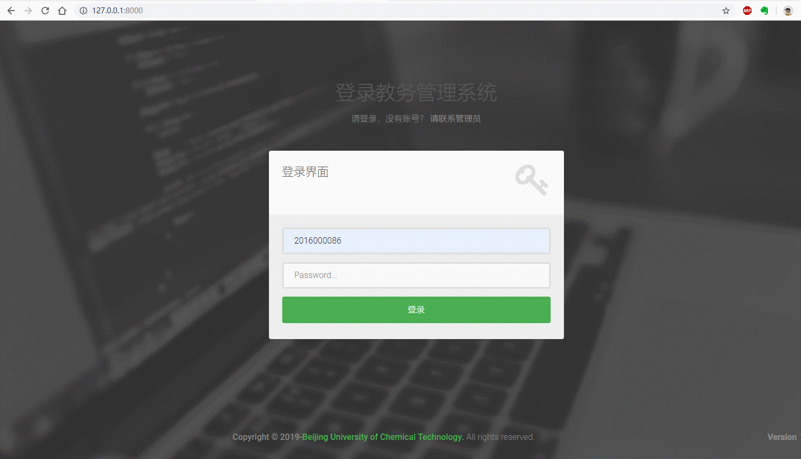

### 后台管理-查看个人信息


### 后台管理-发送通知

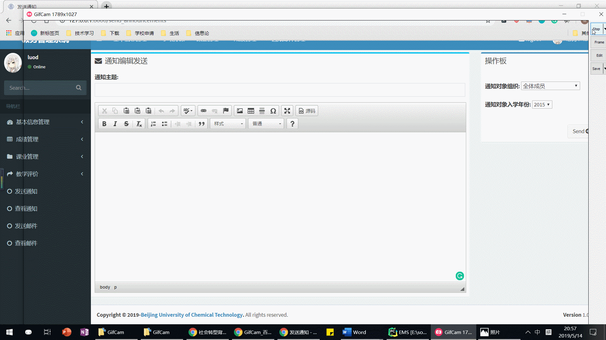

### 后台管理-查看通知

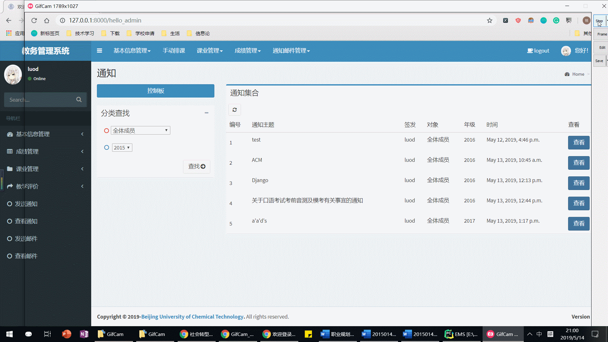

### 排课/选课系统-选课和排必修课生成课表

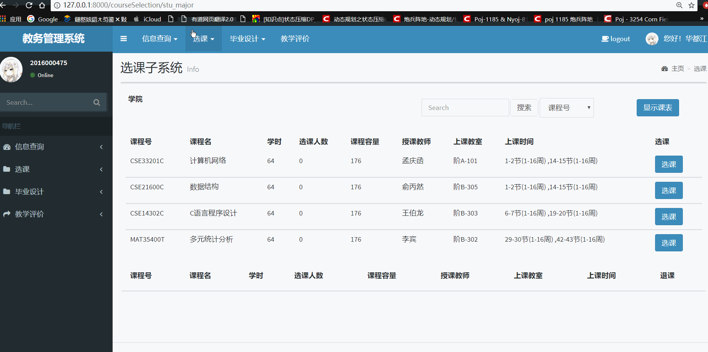


### 成绩管理-查看专业计划
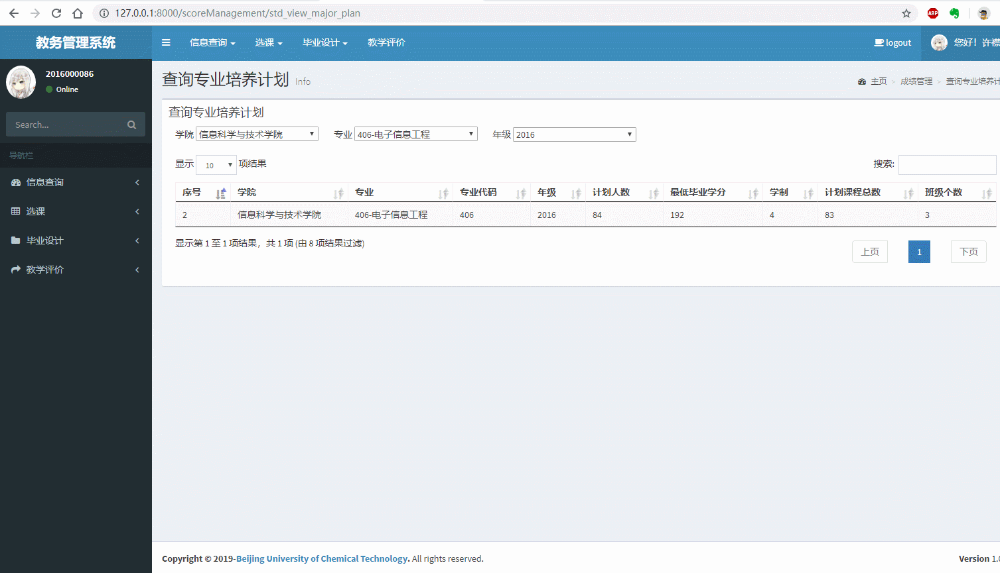

### 成绩管理-查看专业课程

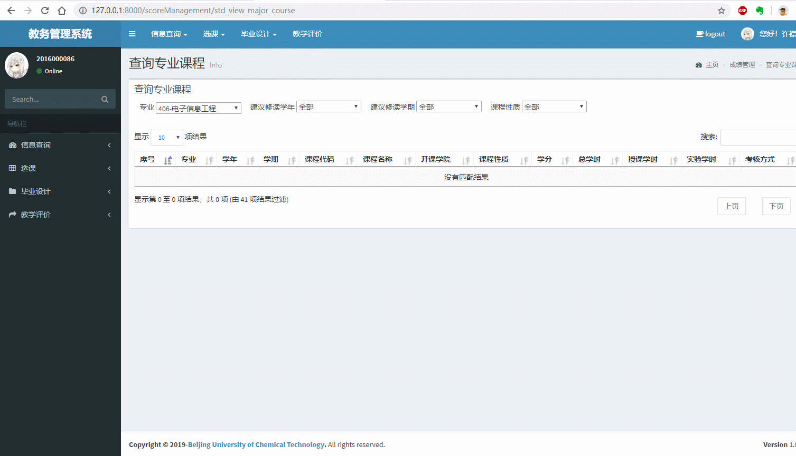

### 成绩管理-查看个人成绩

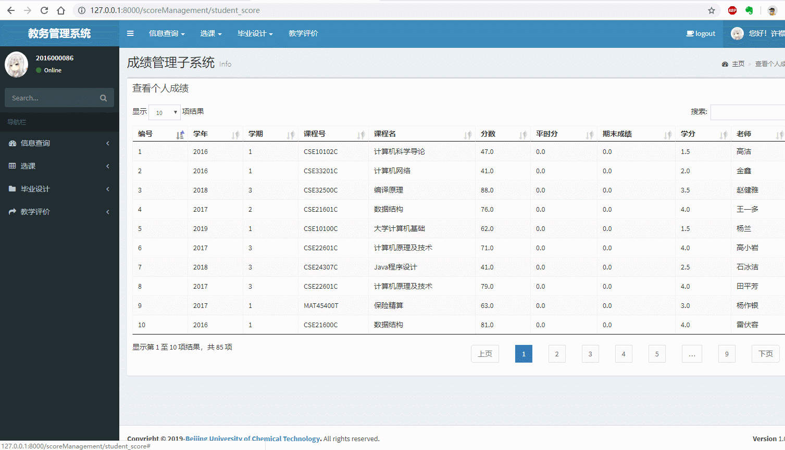


### 成绩管理-查看个人学业情况

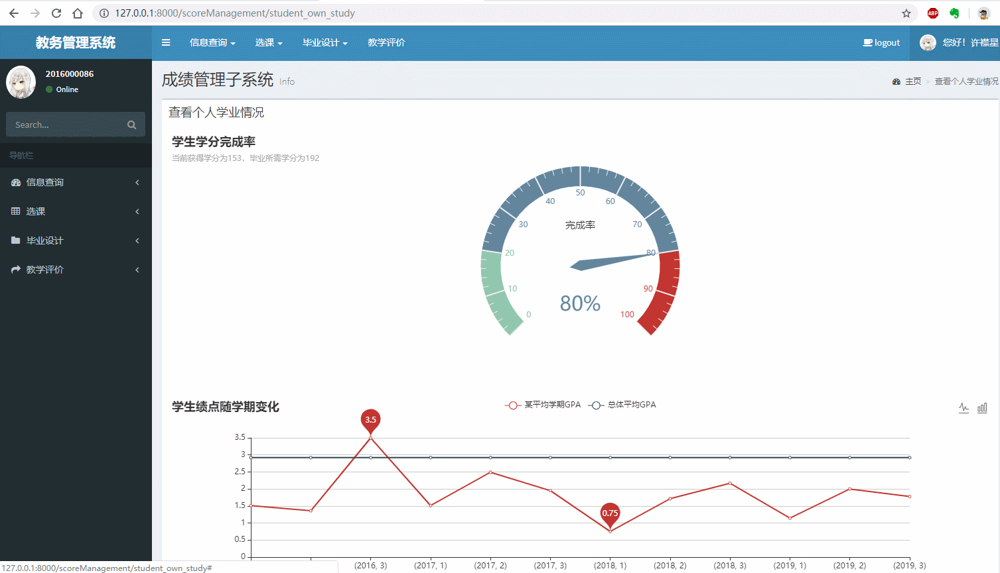

### 成绩管理-教学评价

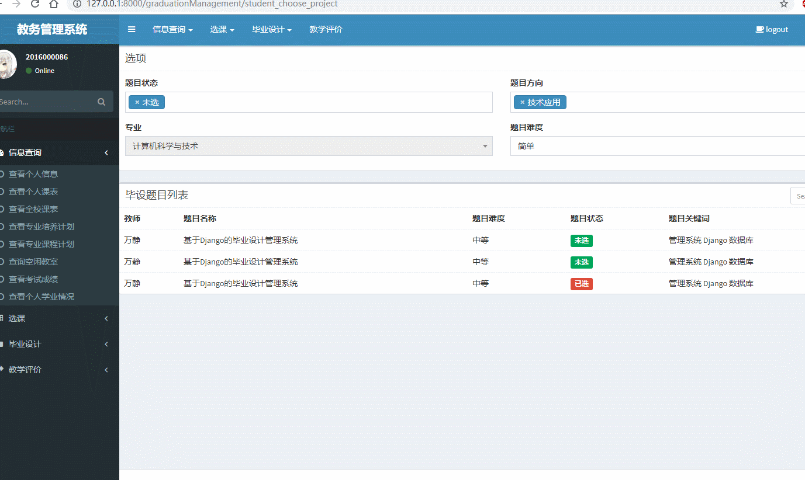

### 成绩管理-教师查看自己/其他老师教的课

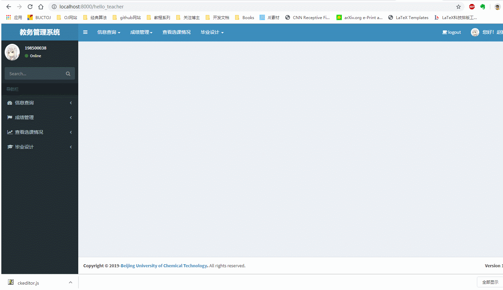

### 成绩管理-教师上传成绩

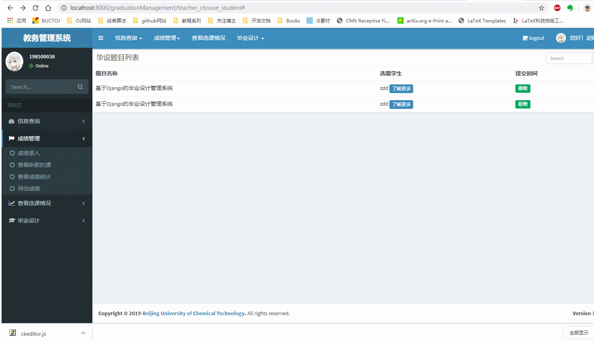

### 毕业设计-学生选题+查看选题状态+上传文档+查看成绩

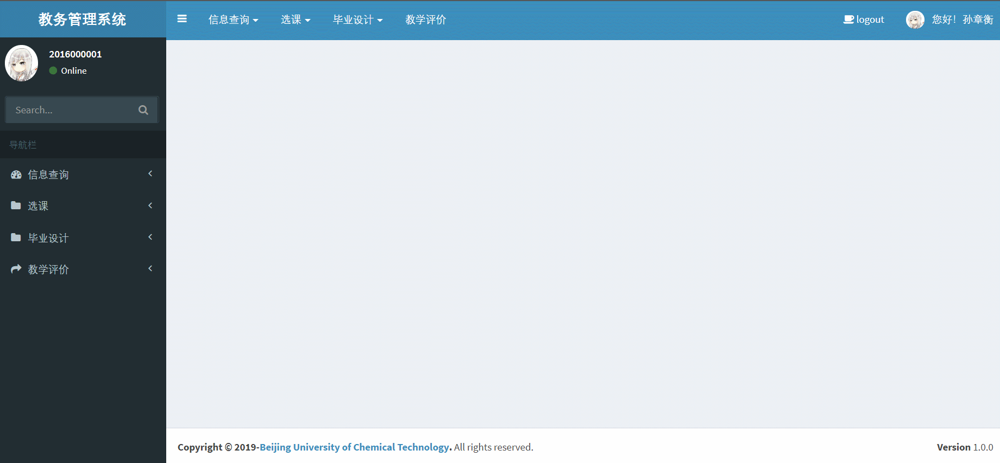

### 毕业设计-教师发布选题+选择学生+查看学生文档+成绩录入

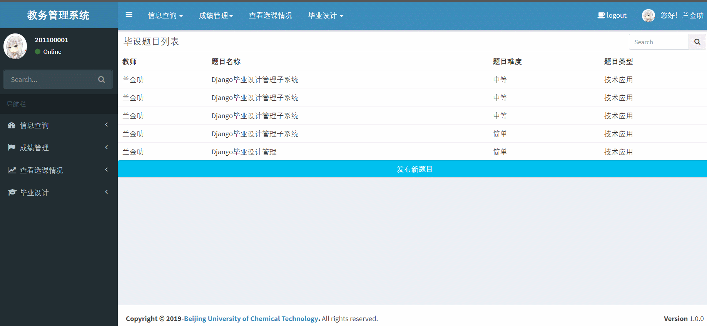

## 如何安装运行本项目

1. clone或下载本项目

```
git clone https://github.com/se-curriculum-design-group/2019-Software-Engineering-Curriculum-Design.git
# 进入到工作或代码目录，外面是github配置文件
cd EMS
# 开始工作
code .
```

2. 安装依赖包

运行项目需要安装`Django==2.1.7`,`pymysql`等

```
pip install -r requirements.txt

# 如果太慢可以使用豆瓣源
pip install -i http://pypi.douban.com/simple  -r requirements.txt
```

3. 创建数据库用户

项目依赖MySQL8.0数据库（5.x与8.x编码不兼容，建议使用8.x），使用统一的用户`EMS`, 密码为`password`登录。

```
mysql> create user 'EMS'@'localhost' identified by 'password';
mysql> grant all on *.* to 'EMS'@'localhost';
```

4. 创建数据库与添加数据

```mysql
mysql> create database ems;
mysql> use ems;
mysql> source ems.sql;
-- 注意这里是EMS文件夹下面的ems.sql
-- 执行这句话会创建数据库表并插入数据
```

或者你可以直接迁移生成数据库表格：

```
python manage.py makemigrations
python manage.py migrate
```
这样操作会在数据库中按照模型字段定义表结构，但是没有数据。**注意**，如果这个时候你再采用，原来的表结构会被删除。**请不要把迁移文件上传到github上，否则容易报错。**

### 如何登录

系统总共有三类角色：学生、教师、管理员，均采用继承和扩展Django自带User类的方式实现。

- 学生，采用默认字段username为学号。同时默认密码password与学号相同（在存入数据库时实现了加密）。（默认学号为10位，不可修改）
- 教师，采用默认字段username为工号。同时默认密码password与工号相同（在存入数据库时实现了加密）。（默认工号为9位，不可修改）
- 管理员，默认为Django superuser。可以通过`python manage.py createsuperuser`命令创建。

### 如何获取数据--使用Shell调试技巧

Python的Shell功能十分强大，如果你安装了IPython，那么体验更好。可以轻松获取数据和操纵数据。

```
python manange.py shell
```

**强烈建议通过Django ORM方式获取所关心的信息，而不要去数据库中疯狂操作**。

```
In [1]: from backstage.models import Student, Teacher

In [2]: Student.objects.first()
Out[2]: <Student: 2016000001-孙章衡>

In [3]: Teacher.objects.first()
Out[3]: <Teacher: 201100001-兰金叻>

In [4]: len(Student.objects.all())
Out[4]: 649

In [5]: len(Teacher.objects.all())
Out[5]: 1033
```

### 管理员登录

管理员使用了Django中的`superuser`类，属于User。默认创建了10个管理员，已经导入到最新的`ems.sql`文件中。用户名默认为`superuser[1-n]`，如`superuser1`，密码同用户名。
也可以通过以下脚本插入

## 如何开发

### github工作流

为了避免各个小组，互相提交代码，导致冲突、覆盖等事情的发生。要求熟练掌握github的使用，遵守合理的开发流程。具体可以参考这篇[博文](https://www.cnblogs.com/selimsong/p/9059964.html)。

首先clone下来主分支项目后，各小组有各自的项目分支，可以在自己的分支上开发代码，测试新的功能特性。

```
git checkout xxxx
```

并且可以将代码推送到远程仓库，进行保存。但是务必要确保自己开发的代码要**时常和主分支同步**，要不然看不到别人的工作。也可以**创建更多**的本地分支，因为git创建分支的代价很小。可以随意地在本地创建分支来开发新的功能或者测试bug，而确保主分支上的代码都是干净清晰可以执行的。

**经常commit**，只要commit后，功能都能被保存并且有机会回滚。因此要多commit。

在开发或者测试新的功能特性完毕之后，要与主分支合并代码。这时重新`checkout master`回到主分支，进行合并。合并完成后就可以推送到远程仓库。

为了避免合并冲突，建议使用图形化工具来避免冲突。这里推荐Github Desktop软件和VS Code插件来查看和解决冲突。虽然PyCharm也自带了图形化的merge工具，个人测试效果不好。

关于冲突的说明，只有当不同人对于同一个文件的同一个地方的代码进行修改的时候才会出现不可消解的冲突，这个时候需要代码编辑者自己做决策。因此在源代码中也会出现像`>>>>>>`,`<<<<<<`,`=======`这样的符号，PyCharm等代码检查工具一片飘红，会让人很紧张。但其实是git在询问你要保留哪一段代码，需要你手动删除解决。这相当于是一个代码复审的过程，避免了错误的修改出现也很重要。

### 不同角色视图说明

采用Django模板继承机制实现不同角色看到的视图不同。在templates文件夹下有四个文件分别为`base.html`,`student_base.html`,`teacher_base.html`,`adm_base.html`。其中`base.html`为所有的基础模板，定义了界面的基准色调，和左侧Slider Bar，顶部导航栏，登录头像，登录状态提示，登出等。
其他三个文件分别继承于`base.html`，并且自定义了自己的Slider Bar和顶部导航栏。其于各个模块中的`html`文件均继承于上述三个文件，确保了不同的角色登录看到的功能均不相同。

其于子模块子需要在` `内部书写`<section></section>`内容即可。

## 软件测试

> 不会写测试的软件工程师不是一个好的软件工程师。

### 对Django进行单元测试

单元测试(Unittest)对于开发出好的软件来说（提前找到Bug，性能优化，提高开发效率）的重要性毋庸置疑，Python常用
的单元测试工具有unittest和mock、pytest等第三方包。但是对于Django而言，有很好的选择。

在每个APP下都有一个`tests.py`文件，这个文件用来做单元测试，其中导入了`TestCase`类，我们就是用它来做测试。Django封装了unittes类（继承）为`TestCase`，一般来说我们编写自己的测试类要继承`TestCase`。在其中定义自己的测试方法，每个方法都以`test_`开头，简单的命名方式为：`test_`+测试方法名，_i_e_.: `test_student_view_score`。

但编写好测试类和测试方法时，执行：
```
python manage.py test
```
便会自动执行测试，并且可以看到测试的执行耗费时间。启动可能会有点慢，因为默认会创建一个数据库（名为：`test_`+项目数据库名），并且会执行迁移`migrate`。但是实际测试时很快的，很适合与CI工具集成测试。

关于`TestCase`用法的几点说明：

1. `TestCase`默认有`setUp()`和`tearDown()`方法，用来做执行测试前的一些初始化工作，比如创建数据库，登录用户等。其执行顺序为
```
setUp()
test_method1()
tearDown()
setUp()
test_method2()
tearDown()
...
```
即会单独的为每个测试方法前后执行一次。我一般用来登录用户保存session。

2. `self.client`是默认的一个客户端对象，**非常重要**，可以用来模拟用户提供http请求，如`POST/GET`等，以及提供数据。需要掌握使用，用Client类来测试自己项目APP下面的每一个URL和view是否正确工作，可以有助于发现Bug。避免提交了再补锅救火。

常用方法：
```python
url = ""
response = self.client.get(url)
self.assertEqual(response.status_code, 200)
self.assertTemplateUsed(response, 'login.html')

url = '/mylogin'
response = self.client.post(url, data=self.log_data)
self.assertIn(response.status_code, [200, 301, 302])
```

**注意**：千万注意，这里的`url`测试的是你在浏览器中访问时`127.0.0.1`后面的东西，**但是要有开始的那个`/`，而不能有最后那个`/`**，否则会404 Not Found。
_i_e_:
`/scoreManagement/stu_view_score`: 正确✔

`/scoreManagement/stu_view_score/`: 错误

`scoreManagement/stu_view_score/`: 错误

`/scoreManagement//stu_view_score/`: 错误

`/mylogin`: 正确✔

`/mylogin/`: 错误

`mylogin`: 错误

用`assertEqual`判断状态码是否是200,如果是404、500、403等，必然是错误，不能上线。

这里的状态码可能是302或者301表示重定向，是正常的，可以用`assertIn`判断。`assertTemplateUsed`用来判断是否使用了正确的模板页面，避免错误。同时可以使用`assertIn`判断关心的内容是否在页面中。一般常用的断言方法也就这几个，更多可以自己查看。

`response`是一个Response对象，有很多方法，比如查看状态码，返回内容等。

3. `python manage.py test`会执行项目所有的测试，为了避免打印太多或者其他项目干扰，可以只执行自己项目中的测试，或者只执行一个测试类、一个测试方法：

```
python manage.py test # 执行所有测试，一般用于集成测试
python manage.py test scoreManagement # 只执行成绩管理测试
python manage.py test scoreManagement.tests.AdmTest # 只执行成绩管理下面的对管理员行为的测试
python manage.py test scoreManegement.tests.AdmTest.test_login # 只执行登录测试
```

4. 关注测试的代码覆盖率，不能水测试，一定要对URL和views.py下面的每个用到的函数都做测试！
5. 一个比较完整的测试样例如下：

```python
class TestStudent(TestCase):
    # 测试初始化函数，每次执行下面的函数之前都会执行这个函数
    # 这里用来创建用户和登录用户，保存session信息
    def setUp(self) -> None:
        # 用mixer这个库用来创建随机的数据
        # 可以递归地创建多层次的外键
        student1 = mixer.blend(Student)
        student1.username = '2016000474'
        # 对密码进行加密
        student1.password = make_encode('2016000474')
        student1.save()
        self.login_data = {
            'username': student1.username,
            'password': student1.username
        }
        data = {
            'username': '2016000474',
            'password': '2016000474'
        }

        url = ""
        response = self.client.get(url)
        self.assertEqual(response.status_code, 200)
        self.assertTemplateUsed(response, 'login.html')

        # 发出一个post请求，并且发送登录的数据
        response = self.client.post('/mylogin', self.login_data)
        self.assertIn(response.status_code, [200, 301, 302])

    def test_student_view_score(self):
        # 发出一个get请求，测试这个url是否正确
        response = self.client.get('/scoreManagement/student_view_score')
        self.assertIn(response.status_code, [200, 301, 302])

    def test_student_view_own_study(self):
        response = self.client.get('/scoreManagement/student_own_study')
        self.assertIn(response.status_code, [200, 301, 302])

    def test_student_view_major_course(self):
        response = self.client.get('/scoreManagement/std_view_major_course')
        self.assertIn(response.status_code, [200, 301, 302])

    def test_student_view_major_plan(self):
        response = self.client.get('/scoreManagement/std_view_major_plan')
        self.assertIn(response.status_code, [200, 301, 302])
```

具体的测试可以查看scoreMangement下的测试文件:[test.py](https://github.com/se-curriculum-design-group/2019-Software-Engineering-Curriculum-Design/blob/master/EMS/scoreManagement/tests.py)

### 使用Travis CI和Codecov

> 始于颜值，陷于才华。为了徽章我也要做集成测试！

Travis CI和Codecov能够对项目进行集成测试和测试覆盖率分析，开源免费，而且对github支持很好。每次提交的代码都会在Travis CI上自动测试，写好配置文件后不需要关心。而且可以自己配置测试矩阵、对不同版本和操作系统进行测试。

1. 注册账号

在[Travis CI官网](https://travis-ci.com/)上注册账号，用github账号关联，选择需要测试的项目。

在[Codecov](https://codecov.io/)上注册账号，用github账号关联，选择项目。

2. 编写`.travis.yml`配置文件

Travis CI是通过配置文件进行测试的，语法比较简单，了解一下`yml`语法就可以，而且可以参考其他的项目配置。本项目的集成测试配置如下：[.travis.yml](https://github.com/se-curriculum-design-group/2019-Software-Engineering-Curriculum-Design/blob/master/.travis.yml)

注意每次提交Push/PR都会被自动拉取测试，如果失败了项目首页Build Status: [](https://travis-ci.com/se-curriculum-design-group/2019-Software-Engineering-Curriculum-Design)就会显示`failing`，因此**不能乱提交**。

3. 关联Codecov后，简单修改`.travis.yaml`就可以在Codecov上看到代码覆盖率分析了。

**需要注意的是**：原来运行Django项目测试用
```
python manage.py test
```
如果要添加分析功能，使用命令行
```
coverage run manage.py test
```

4. 要尽量提高代码覆盖率，对每一个URL做测试。


## 项目进度

### 后台管理

**职责说明**：

>**维护**校内所有学生和教师信息、**维护**所有的课程信息、**维护**所有的教室信息。
管理教务管理系统的不同类型的用户账号，进行**权限维护**。发布各类**通知**信息。为系统的使用提供帮助，以及模板**文档的下载**。实现不同用户组的**邮件群发**。对成绩达不到毕业要求的学生，发出**学位警告通知**。

- [x] 关于基础表格的属性和字段已经创建完毕。并且成功导入相应的数据。方便轻松导入。
- [x] 全校教室表还没有导入对应数据，这个需要与排课小组详细讨论确定结果。教室的**容量余量**等信息会影响排课。
- [x] 完成前后端交互的对教室、教师、学生的增删改查的功能。对于增删改要求使用Ajax异步交互的方式，与后端交互验证。不能直接找不到报错或者重复报`DoesNotExiest`或者`Integrity Error`。[参考代码](https://github.com/RonDen/2018DBDesign/tree/FirstKind/templates)。
- [ ] 完成学生和老师的批量导入功能。系统不提供直接的前台注册功能（不符合教务管理系统的性质），而是直接批量导入。通过Excel表格导入（建议使用Pandas）或者数据库脚本插入。要求提供前端交互界面，Excel模板下载方法。[参考代码](https://github.com/se-curriculum-design-group/2019-Software-Engineering-Curriculum-Design/tree/master/EMS/utils/database_utils)
- [ ] 完成邮件功能。群发和单发。[参考代码](http://www.liujiangblog.com/course/django/175)
- [x] 完成系统通知发送和显示功能。可以参考博客或类似评论系统的实现。


### 成绩管理

**职责说明**：

> 成绩管理子系统管理学生的**课程成绩**并提供**课程评价**功能。教师可**提交成绩**，**打印成绩**，**下载成绩**汇总。学生可**查看课程成绩**，查看个人已选课程成绩汇总信息，并可下载打印。最后系统应能够向管理员提供**查询界面**和**各类报表**，**统计**学生成绩情况。系统提供基于Web的访问，同时支持学生通过手机查看个人成绩。


- [x] 课程信息的构建。
- [x] 学生课程成绩信息的构建。包括数据的导入。
- [x] 实现教学评价功能。
- [x] 完善评教功能，评教和查询成绩的约束。查看成绩需要完成评价。
- [x] 实现按学号筛选，找到学生选修的课程以及对应成绩得分。包括平时分和最终考试得分。实现学生的个人成绩查询。
- [x] 实现学生个人的成绩汇总和分析界面。
- [ ] 实现教师通过Excel表格上传成绩的功能。提供上传成绩的Excel表格模板下载地址。
- [ ] 提供老师对自己所教学班级的成绩分析功能。根据老师筛选出所教课程，并在界面上显示各个班级的成绩情况（需要展现出重要统计信息，如平均分，不及格率、优秀率等，绘制相应的分布图表。直方图和饼图）。在此页面提供导出PDF和班级成绩Excel表格的功能。导出方便打印或进一步分析。
- [ ] 提供关于专业和行政班的查询和统计分析功能。导出成绩信息为Excel表，便于辅导员等相关人员进行分析。
- [x] 实现了系统管理员查询、修改、删除成绩数据的功能。
- [ ] 完善系统管理员查询功能，添加下拉框查询，提供各**专业**级别的成绩统计分析功能。
- [ ] 向系统管理员展示各个专业年GPA走势，绘制相应的图表（分布图和趋势图）。提供导出图表功能PDF和Excel。
- [x] 对不同角色跳转的功能，避免学生通过path进入管理员或者教师的界面。（已经在session中记录了用户type）

### 排课子系统

**职责说明**：

> 为教师教授的课程安排教室和上课时间。一个教师在一个学期可能承担多门的课程，这些课程的时间不应冲突。一个教室在同一时间只能安排一门课程。教务管理人员登录后，可以进行排课，查询教室使用情况，教师课程安排情况，还可以临时为一些教学活动安排教室。学生登录，可以查看每门课的上课时间和地点。教师登录可以看到个人承担课程的上课时间和地点，可以查看某个专业的推荐课表，其他教师的课表等。系统应能够向管理员提供查询界面和各类报表，统计排课情况。系统提供基于Web的访问，同时支持教师和学生通过手机APP查看排课情况、考试时间地点。

- [x] 完成排课所需要的数据结构和数据库表格的创建。
- [x] 实现排课算法。
- [ ] 提供对空闲教室的前端查询功能。这个功能对学生、教师、管理员都需要提供。
- [ ] 完成手动排课前端交互功能（要求界面友好）。
- [ ] 对管理员提供借教室，也就是将空闲教室修改为占用的功能。用于安排临时教学活动。标明占用时间。

### 选课子系统

**职责说明**：

>课程分为研究生课程和本科生课程；也可以分为必修、选修、辅修。学生以学号和密码登陆，系统显示用户已选的课程、用户有权选但未选的其他课程，并显示具体信息（如学分）。学生选择后，系统根据规则检查用户是否进行正确的选课（如时间冲突、跨专业选课等）；如果错误提示用户改，否则修改选课数据库。教师可以查看自己所教授课程的选课情况，下载选课名单。最后系统应能够向管理员提供查询界面和各类报表，统计每门课的选课情况。系统提供基于Web的访问，同时支持学生通过手机APP选课。
- [x] 完成选课子系统涉及到的数据库表格的设计和创建。
- [x] 独立完成管理员能够进入选课设置选课时间功能，提升了管理员操作的灵活性，学生进入选课系统会判断当前是否是选课时间，如果不是则返回提示。
- [x] 完成管理员查看全校课程信息界面，并且管理员可以导出报表，实施各种各样的数据分析
- [x] 教师界面的实现，教师方面包含两个界面，分别是教师查看自己所教授的课程页面和教师查看所教授课程的选课成绩，同时实现了导出表格的功能，以供教师进行实时点名等功能。
- [x] 学生界面的实现，学生界面包含学生选课和学生查看课表功能，学生选课方面，学生首先能够查看其他专业的课程，但是不能选，其次学生能够进行专业选修课的选课，同时利用numpy对学生选课中的从冲突检测进行了较大的优化，使得速度提升。
- [x] 设计并实现完成选课需要的数据结构和数据库表格。提供对应的测试数据。
- [x] 学生能够查看自己的课表，并且导出成pdf格式。这一点参考了jsPDF.bug.js和HTML2canvas中对于课程表的实现，相比于传统教务管理系统的课表，配色更加丰富，更加适合年轻人群。


### 毕业设计子系统

**职责说明**：

>管理毕业设计选题和成绩。教师可以提交多个毕业设计题目，描述题目要求和对学生的要求。学生可以浏览教师发布的毕业设计题目，进行选择。在学生完成选择后，针对每个题目教师确认选择一个学生。学生向系统提交毕业设计各种文档。教师可以查看学生提交的毕业设计文档，提交毕业设计最后成绩。最后系统应能够向管理员提供查询界面和各类报表，统计毕业设计选题情况和学生成绩。系统提供基于Web的访问，同时支持学生通过手机APP查看选题和查看成绩。

- [x] 完成毕业设计系统涉及到的数据库表格的设计和创建。
- [x] 学生浏览题目并选择题目的界面。（要注意权限和验证，是否是跨专业，是否可以跨专业。选多个的错误提示。选题截至时间的显示。选完题之后要求系统自动发送通知到对应用户消息箱）。
- [x] 学生在系统上提交相应文档。可以使用`FileField`。[参考代码](http://www.liujiangblog.com/course/django/95)
- [x] 教师界面的实现。发布课题。查看多少人选了自己的课题。多少课题未选。
- [x] 教师能够查看学生提交的文档（是直接在浏览器查看还是下载查看？`.docx`文档和压缩包文档可能无法实现浏览器查看。是否包含图片文件？`ImageField`，保存路径等）
- [ ] 管理员实现总体的（或者专业级别，老师级别的）毕业设计选题分析查询的界面和分析图表。


