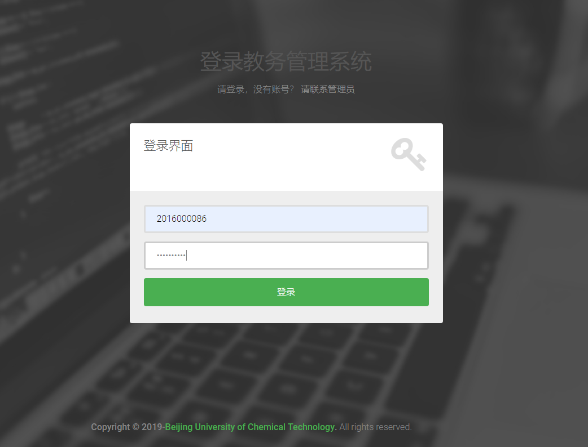
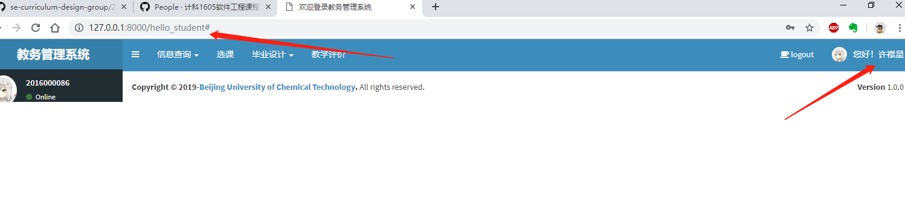
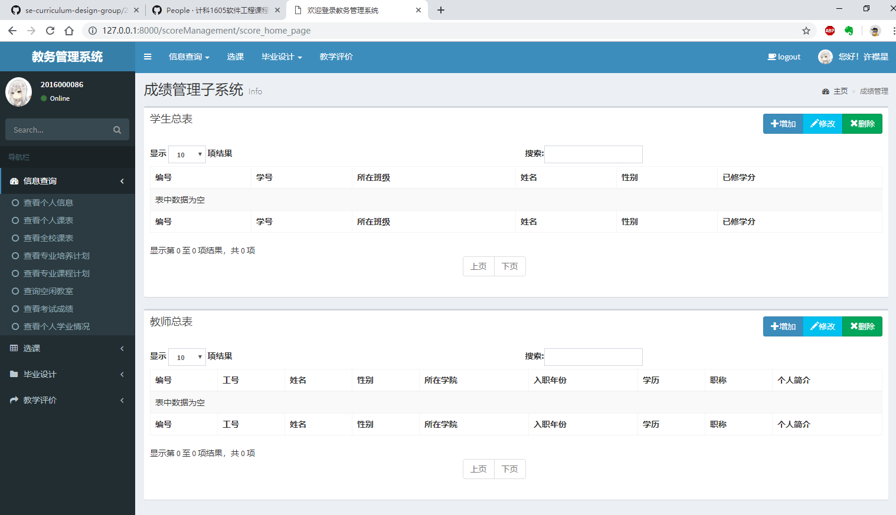
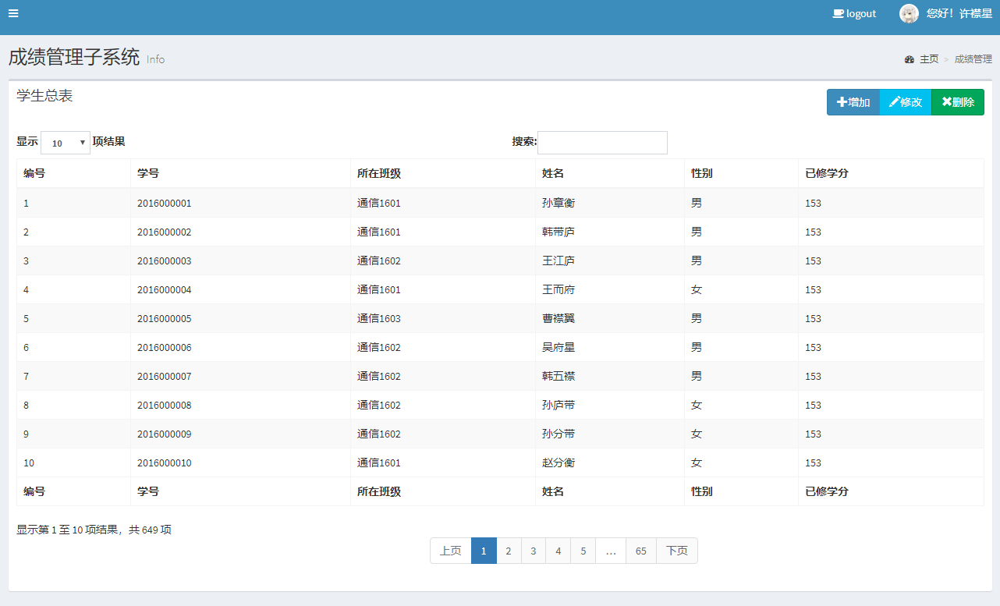

# 2019年软件工程课程设计

**New Version**, **new design** and **new base**...Happy coding and hacking. :+1
采用的新的前端框架，全新的模板继承设计。规范了项目结构。
---

## 查看运行效果






## 关于角色和如何登录

### 角色分类

系统总共有三类角色：学生、教师、管理员，均采用继承和扩展Django自带User类的方式实现。

- 学生，采用默认字段username为学号。同时默认密码password与学号相同（在存入数据库时实现了加密）。（默认学号为10位，不可修改）
- 教师，采用默认字段username为工号。同时默认密码password与工号相同（在存入数据库时实现了加密）。（默认工号为9位，不可修改）
- 管理员，默认为Django superuser。可以通过`python manage.py createsuperuser`命令创建。

### 如何获取

**强烈建议通过Django ORM方式获取所关心的信息，而不要去数据库中疯狂操作**。

```
In [1]: from backstage.models import Student, Teacher

In [2]: Student.objects.first()
Out[2]: <Student: 2016000001-孙章衡>

In [3]: Teacher.objects.first()
Out[3]: <Teacher: 201100001-兰金叻>

In [4]: len(Student.objects.all())
Out[4]: 649

In [5]: len(Teacher.objects.all())
Out[5]: 1033
```

## 不同角色视图说明

采用Django模板继承机制实现不同角色看到的视图不同。在templates文件夹下有四个文件分别为`base.html`,`student_base.html`,`teacher_base.html`,`adm_base.html`。其中`base.html`为所有的基础模板，定义了界面的基准色调，和左侧Slider Bar，顶部导航栏，登录头像，登录状态提示，登出等。
其他三个文件分别继承于`base.html`，并且自定义了自己的Slider Bar和顶部导航栏。其于各个模块中的`html`文件均继承于上述三个文件，确保了不同的角色登录看到的功能均不相同。

其于子模块子需要在` `内部书写`<section></section>`内容即可。

## 如何安装和运行本项目

1. clone本项目
2. 配置数据库，生成迁移文件（注意删除之前的迁移文件，如果你没有迁移过的话）。
3. 导入数据。进入mysql控制台，激活对应数据库，`source ems.sql`即可导入数据。
4. 运行项目。`python manage.py runserver`即可在浏览器`8000`端口查看。

## 关于如何开发提交代码

为了避免各个小组，互相提交代码，导致冲突、覆盖等事情的发生。要求熟练掌握github的使用，遵守合理的开发流程。具体可以参考这篇[博文](https://www.cnblogs.com/selimsong/p/9059964.html)。

首先clone下来主分支项目后，各小组有各自的项目分支，可以在自己的分支上开发代码，测试新的功能特性。

```
git checkout xxxx
```

并且可以将代码推送到远程仓库，进行保存。但是务必要确保自己开发的代码要时长和主分支同步，要不然看不到别人的工作。也可以创建更多的本地分支，因为git创建分支的代价很小。可以随意地在本地创建分支来开发新的功能或者测试bug，而确保主分支上的代码都是干净清晰可以执行的。

在开发或者测试新的功能特性完毕之后，要与主分支合并代码。这时重新`checkout master`回到主分支，进行合并。合并完成后就可以推送到远程仓库。

为了避免合并冲突，建议使用图形化工具来避免冲突。这里推荐Github Desktop软件和VS Code插件来查看和解决冲突。虽然PyCharm也自带了图形化的merge工具，个人测试效果不好。

关于冲突的说明，只有当不同人对于同一个文件的同一个地方的代码进行修改的时候才会出现不可消解的冲突，这个时候需要代码编辑者自己做决策。因此在源代码中也会出现像`>>>>>>`,`<<<<<<`,`=======`这样的符号，PyCharm等代码检查工具一片飘红，会让人很紧张。但其实是git在询问你要保留哪一段代码，需要你手动删除解决。这相当于是一个代码复审的过程，避免了错误的修改出现也很重要。

对于添加文件，添加代码等操作多半是不会造成不可消解冲突的，但是这也带来了新的问题，就是很多没用的文件一直被保存而上传，因此需要创建者及时将无用的文件删除。如`.pyc`文件，这种文件不适合上传到github中，请及时删除`git rm -f *.pyc`。还有一些用来测试的`py`文件和`html`文件，也要及时删除，保持项目结构精简。

