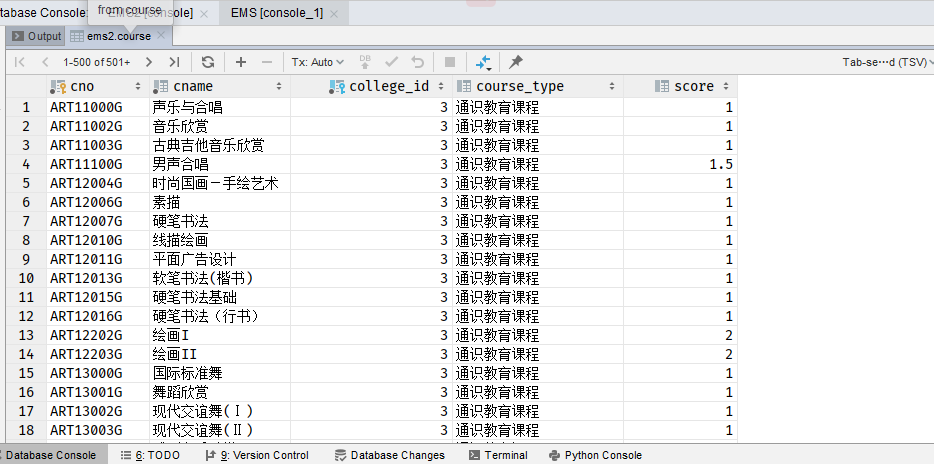
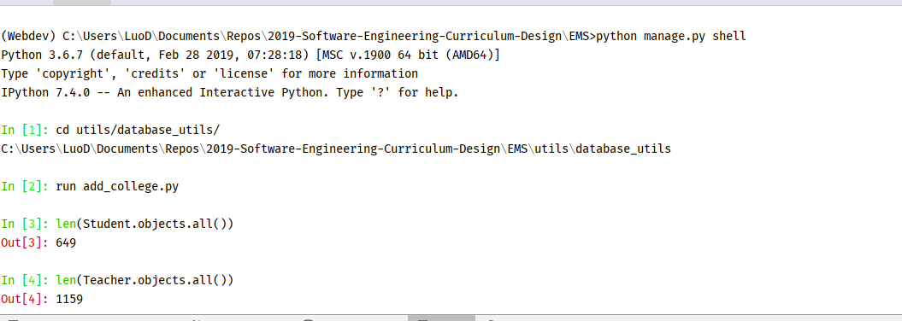
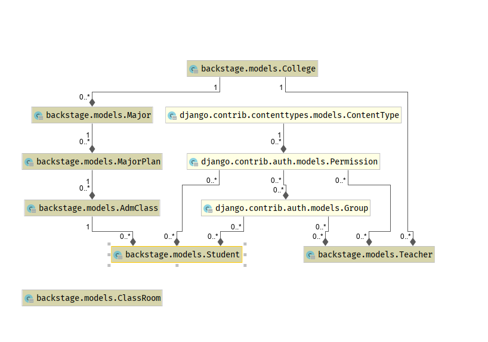
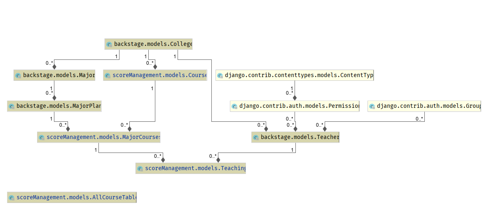

# 2019年软件工程课程设计--成绩管理子系统开发分支

Author: LuoD
---

## 描述

创建了基本的表格与和成绩管理相关的表格，搭建了项目基础框架。

包括学生、教师、课程、专业、学院、专业计划、专业课程计划、教师授课表。





## backstage中的表



## backstage中的表

**学院表**

|字段名|描述|备注|
|:----:|:-----:|:-------:|
|name|学院名|
|short_name|学院简称|

**专业表**

|字段名|描述|备注|
|:----:|:-----:|:---------:|
|mno|专业代码|如0403，04是所在学院的排序，03是在专业中的排序|
|mname|专业名称|唯一，如：计算机科学与技术， 化学工程与工艺|
|short_name|专业简称|如：计算机科学与技术--计科， 化学工程与工业--化工|
|in_college|所属学院|外键|

**专业信息**

|字段名|描述|备注|
|:----:|:-----:|:---------:|
|year|学年|该专业下的那个年级的学生|
|major|专业名称|对应了需要的专业|
|cls_num|专业计划班级数|
|people_num|专业计划人数|
|score_grad|毕业最低学分|
|stu_years|学制|毕业需要学习的年数, 4|
|course_num|该年级专业需要修学的课程数|80, 88...|

**行政班**

|字段名|描述|备注|
|:----:|:-----:|:---------:|
|name|行政班名|如：计科1605|
|major|行政班所属专业|由 major.short_name + in_year + 编号（自增）构成,例如：计科1605， 化工1606|

**学生**

|字段名|描述|备注|
|:----:|:-----:|:---------:|
|name|学生姓名|
|username|学号|必须10位，例如：2016011186|
|password|登录所需密码|初始密码设置为学号|
|sex|学生性别|
|score_got|目前已修学分|
|in_cls|所在的行政班级|外键|
|in_year|入学年份|用int表示即可，该学生入学的年份，考虑可能留级的情况，入学年份与专业年级不对应|

**教师**

|字段名|描述|备注|
|:----:|:-----:|:---------:|
|name|教师姓名|
|username|自带字段，同时也就是教师工号|设置为9位，与学生区分|
|password|自带字段，登录所需密码|默认与工号相同|
|sex|性别|
|college|教师所属学院|
|in_year|教师入职的年份|
|edu_background|学历|在个人信息中显示,如：博士，博士后...|
|title|在校职位|如：教授，副教授，讲师等|
|description|教师个人简介|可空|

**教室**

|字段名|描述|备注|
|:----:|:-----:|:---------:|
|crno|教室编号|如：A-302， B阶-202|
|crtype|教室类型|阶教180人，中等教室120人，小教室50人,教室类型需要和教室编号对应|
|contain_num|教室能够容纳的学生数目|需要与类型对应|

## scoreManagement中的表



# backstage中的表

 **课程信息表**

|字段名|描述|备注|
|:---:|:---:|:---:|
|cno|课程编号|长度必须为9位，如：MAT13904T--高数，3位英文+5位数字+一位英文|
|cname|课程名称|需要与编号对应|
|college|开课学院|需要从学院中选取对应的老师来上课|
|course_type|课程性质||
|score|该门课程在该专业对应的学分||

**专业对应课程信息表**

|字段名|描述|备注|
|:---:|:---:|:---:|
|cno|课程编号||
|mno|对应到的专业计划信息|注意，这里都是外键，需要传入的是对象引用|
|hour_total|总学时|该门课程在该专业对应的总学时|
|hour_class|讲课学时|总学时中用于讲课的学时|
|hour_other|实践学时|hour_total - hour_class|
|year|开课学年|主要这里的开课学年与MajorPlan中的年级不同，这里是指上这门课的学年|
|semester|开课学期|1，2，3学期，3表示小学期|
|exam_method|考核方式|考核--True or 考察--False|

**教师授课表**

|字段名|描述|备注|
|:---:|:---:|:---:|
|tno|教师工号|教授课程的教师工号|
|tname|教师名称|教授课程的教师名称，为了显示方便，可以冗余|
|mcno|这门课对应所在的专业培养计划||
|weight|教师给的本课程的平时分权重|如：0.3，0.2|

**全校课表**

注意这是一张用于参考的表，没有实际含义的对应的外键

|字段名|描述|备注|
|:---:|:---:|:---:|
|state|开课状态，默认开课--0||
|cno|课程编号--1||
|cname|课程名称--2||
|score|学分--3||
|exam_method|考核方式--4||
|course_type|课程类型--5||
|teachers|--6||
|teach_class_name|--7||
|week_duration|--8||
|class_time|--9||
|class_location|--10||
|college|--11||
|adm_classes|--12||
|year|--13||
|semester|--14||


## 用法

1. 删除`backstage`和`scoreManagement`下面的迁移文件。重新生成迁移文件。
2. 进入MySQL数据库，`create database ems2`（为了测试，这里用的是`ems2`）。
3.
```
(Webdev) C:\Users\LuoD\Documents\Repos\2019-Software-Engineering-Curriculum-Design\EMS>python manage.py makemigrations
Migrations for 'backstage':
  backstage\migrations\0001_initial.py
    - Create model AdmClass
    - Create model ClassRoom
    - Create model College
    - Create model Major
    - Create model MajorPlan
    - Create model Student
    - Create model Teacher
    - Add field major to admclass
    - Alter unique_together for majorplan (1 constraint(s))
Migrations for 'scoreManagement':
  scoreManagement\migrations\0001_initial.py
    - Create model AllCourseTable
    - Create model Course
    - Create model MajorCourses
    - Create model Teaching
    - Alter unique_together for majorcourses (1 constraint(s))

(Webdev) C:\Users\LuoD\Documents\Repos\2019-Software-Engineering-Curriculum-Design\EMS>python manage.py migrate
Operations to perform:
  Apply all migrations: admin, auth, backstage, captcha, contenttypes, scoreManagement, sessions
Running migrations:
  Applying contenttypes.0001_initial... OK
  Applying auth.0001_initial... OK
  Applying admin.0001_initial... OK
  Applying admin.0002_logentry_remove_auto_add... OK
  Applying admin.0003_logentry_add_action_flag_choices... OK
  Applying contenttypes.0002_remove_content_type_name... OK
  Applying auth.0002_alter_permission_name_max_length... OK
  Applying auth.0003_alter_user_email_max_length... OK
  Applying auth.0004_alter_user_username_opts... OK
  Applying auth.0005_alter_user_last_login_null... OK
  Applying auth.0006_require_contenttypes_0002... OK
  Applying auth.0007_alter_validators_add_error_messages... OK
  Applying auth.0008_alter_user_username_max_length... OK
  Applying auth.0009_alter_user_last_name_max_length... OK
  Applying backstage.0001_initial... OK
  Applying captcha.0001_initial... OK
  Applying scoreManagement.0001_initial... OK
  Applying sessions.0001_initial... OK

(Webdev) C:\Users\LuoD\Documents\Repos\2019-Software-Engineering-Curriculum-Design\EMS>python manage.py migrate
Operations to perform:
  Apply all migrations: admin, auth, backstage, captcha, contenttypes, scoreManagement, sessions
Running migrations:
  No migrations to apply.


```
4. MySQL中运行`source ems.sql`。即可将数据导入数据库中。
5. 进入交互式IPython进行测试。

```
(Webdev) C:\Users\LuoD\Documents\Repos\2019-Software-Engineering-Curriculum-Design\EMS>python manage.py shell
Python 3.6.7 (default, Feb 28 2019, 07:28:18) [MSC v.1900 64 bit (AMD64)]
Type 'copyright', 'credits' or 'license' for more information
IPython 7.4.0 -- An enhanced Interactive Python. Type '?' for help.

In [1]: cd utils/database_utils/
C:\Users\LuoD\Documents\Repos\2019-Software-Engineering-Curriculum-Design\EMS\utils\database_utils

In [2]: run add_college.py

In [3]: len(Student.objects.all())
Out[3]: 649

In [4]: len(Teacher.objects.all())
Out[4]: 1159

```

## Possible Problem

如果在直接执行`source ems.sql`的时候，遇到外键问题，无法创建`course`表。
可以直接打开`ems.sql`找到相应的语句粘贴在MySQL终端执行。